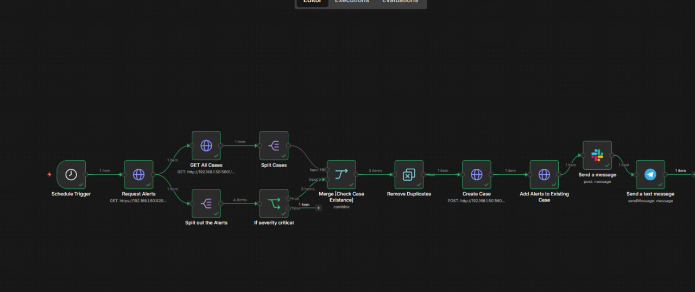

### **1. Executive Summary**

This report outlines the implementation of an automated security incident response pipeline using **n8n**. The workflow is designed to bridge the gap between detection (**Elasticsearch**) and incident management (**Kibana Cases**), while providing real-time notifications via **Slack** and **Telegram**.

---

### **2. Workflow Architecture**

The automation follows a linear logic to ensure only unique and critical alerts are processed:

- **Data Acquisition:** * **Schedule Trigger:** Executes the workflow at defined intervals.
    - **Request Alerts (Elasticsearch API):** Fetches security alerts using a JSON query filtered by time (`now/d`) and status (`open`).
- **Case Synchronization:**
    - **GET All Cases:** Retrieves existing Kibana cases to prevent creating duplicate tickets for the same issue.
- **Processing & Filtering:**
    - **Split Out Alerts:** Breaks down the array of alerts into individual items.
    - **Severity Filter:** An "If" condition that ensures only **Critical/High** severity alerts proceed.
    - **Merge & Deduplication:** Compares incoming alerts with existing cases. Only "Non-Matches" (new alerts) are allowed to pass.
- **Action & Notification:**
    - **Create Case:** Automatically generates a new case in Kibana with mapped metadata (Title, Severity, Description).
    - **Multi-Channel Alerting:** Sends formatted, time-zone-adjusted (Cairo Time) notifications to both **Slack** and **Telegram** simultaneously.

---

### **3. Key Features**

- **Time-Zone Correction:** Using `$now.setZone('Africa/Cairo')` to ensure operational accuracy for the local SOC team.
- **Noise Reduction:** Implemented deduplication logic to maintain a clean incident management environment.
- **Redundancy:** Dual-platform notification system ensures no critical alert is missed if one platform faces downtime.

---

### **4. Impact on SOC Operations**

- **Reduced MTTR (Mean Time to Respond):** Alerts are transformed into actionable cases within seconds of detection.
- **Manual Effort Elimination:** Analysts no longer need to manually copy alert details into cases.
- **Better Tracking:** Every critical alert is documented in Kibana and logged for future auditing.

---

**Reporting Officer:** Saeed Elfiky
**Date:** May 7, 2026
