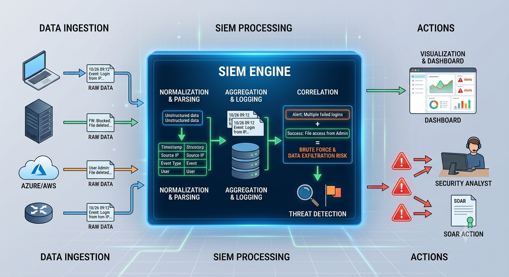

# SIEM Event Correlation and Incident Investigation

**By:** Saeed Elfiky



# **What is SIEM?**

In general definition SIEM stands for Security information and event management, ln basic terms SIEM is a solution that aggregates log and event data, threat intelligence, and security alerts to provide actionable insight on potential security events.


# How does it work?

## 1. Collecting Data

SIEM collects security events from various sources, such as Operating Systems, Databases, Applications, and Network devices. 

### **But how?**

For example, let's look at a standard laptop as our target endpoint to monitor. In many cases, an agent is installed on the endpoint to collect logs and forward them to the SIEM, although some data sources use APIs, Syslog, or other collection methods.


## 2. Normalization

This is where the SIEM comes into play to **normalize, aggregate, and categorize** the data. Why this is the most important step? Because, as we mentioned, we collect a huge number of events from various sources, all of them have different formats, making it incredibly difficult to search or apply security rules based on the event pattern. 

### **Event Storage**

Normalized events are stored in a secure and centralized database. This allows for historical analysis, compliance reporting, and forensic investigations.

## 3. Correlation Engine

This is the heart of a SIEM system, responsible for correlating security events across the environment. By analyzing data from multiple sources, the correlation engine can identify patterns and relationships between seemingly unrelated events. This capability is essential for detecting multi-stage attacks, where individual actions may appear harmless on their own but, when viewed together, reveal a coordinated and potentially serious security threat.

To fully understand how correlation is so important let we consider having these events;

Event 1 from Active Directory: `User "saeed.elfiky" successfully logs in to a workstation`

Event 2 from Endpoint Security: `Five minutes later, PowerShell executes an encoded command`

Event 3 from Firewall: `The workstation initiates a connection to a known malicious IP address`

Event 4 from File System: `Several suspicious executable files are created in the user's AppData directory`

Individually, none of these events may trigger a critical alert. However, the SIEM correlates these events based on:

- Same hostname
- Same user account
- Same timestamp

## 4. Alerting

### **Event vs. Alert: Understanding the Difference**

In the world of SIEM, it’s important to distinguish between **events** and **alerts**. An **event** is any activity logged by a system, such as a login attempt, software update, or file access.
An **alert**, on the other hand, is triggered when SIEM event correlation identifies a pattern of events that fit predefined criteria for suspicious activity. For example, a series of failed login attempts followed by successful access to a sensitive database may generate an alert, signaling potential unauthorized access.

### **Detection**

Detection involves analyzing events to identify potential security incidents. SIEM systems use predefined rules, signatures, and behavioral analysis to detect anomalies or patterns indicative of security threats. Rules might include conditions like multiple failed login attempts, access from unusual locations, or known malware signatures.

**Here is an example for a simple brute force detection rule:**

```jsx
ActionType == "LogonFailed" | summarize count() by AccountName, DeviceName | where count_ > 10
```

- **`ActionType == "LogonFailed"`**
This filters out the noise. It drops all successful logins and only keeps the logs where a login attempt actually failed.
- **`| summarize count() by AccountName, DeviceName`**
This is the grouping mechanism. It counts up the total number of failed attempts and groups them specifically by who tried to log in (`AccountName`) and which machine they targeted (`DeviceName`).
- **`| where count_ > 10`**
This is your threshold. It hides normal daily typos and only triggers an alert if a single user account fails to log in to a specific machine more than 10 times.

## **5. The Role of SIEM in Incident Forensics**

Think of a SIEM as the central hub of a security operation. It continuously collects and analyzes security events from across the environment, providing security teams with the visibility needed to detect and investigate threats. 

SIEM supports incident investigations by:

- Collecting logs from endpoints, servers, applications, databases, and network devices.
- Normalizing data from different sources into a standardized format.
- Correlating events to identify suspicious patterns and potential attacks.
- Maintaining detailed logs that help analysts reconstruct a timeline of events.
- Generating alerts when predefined rules or suspicious behaviors are detected.

For example, a SIEM may correlate a successful login event, the execution of a suspicious PowerShell command, and an outbound connection to a known malicious IP address. Individually, these events may appear harmless, but together they can indicate a compromised system.

By centralizing security data and correlating related events, SIEM enables analysts to investigate incidents more efficiently, understand attack paths, and respond to threats more quickly.