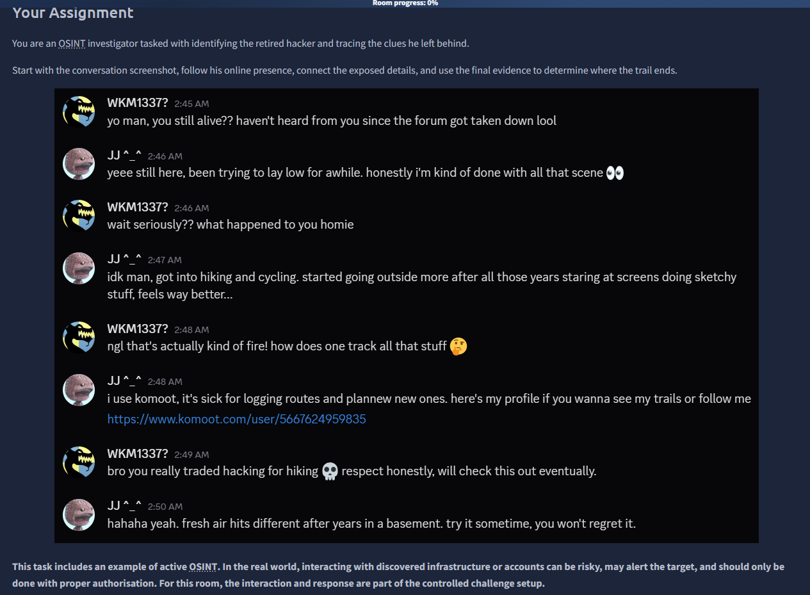
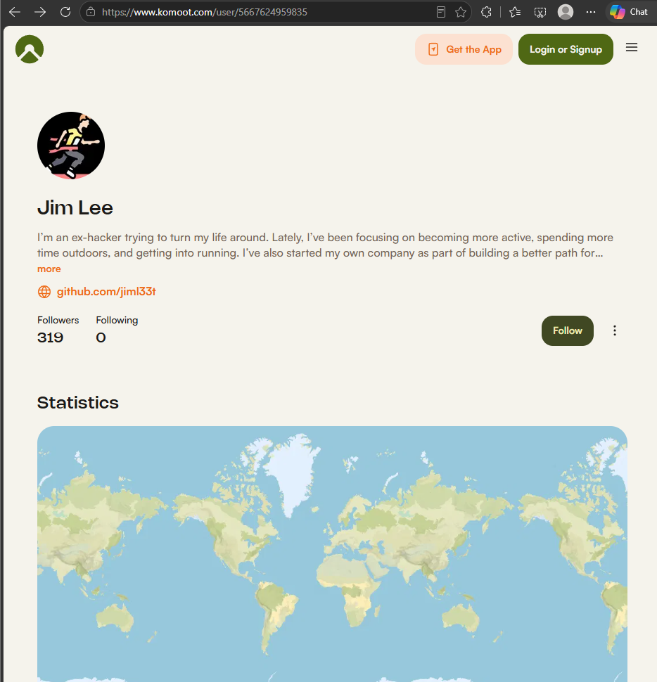
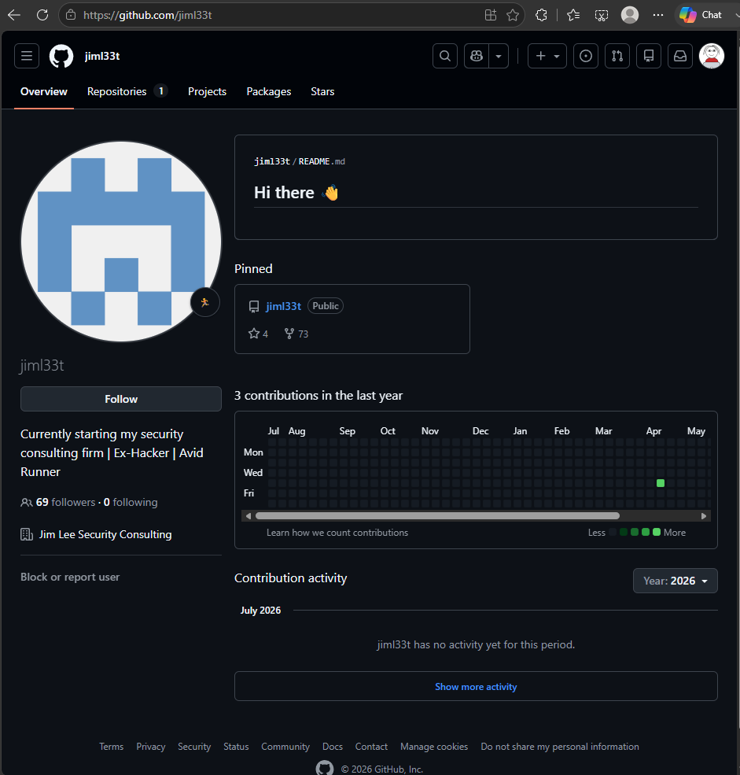
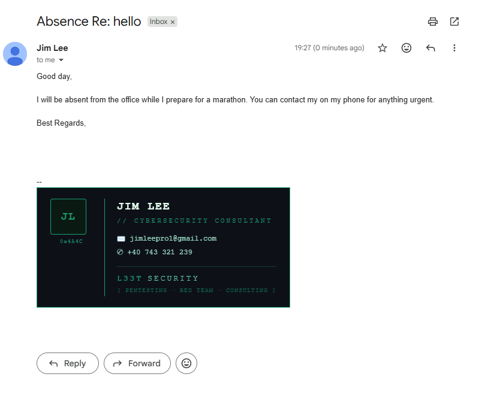
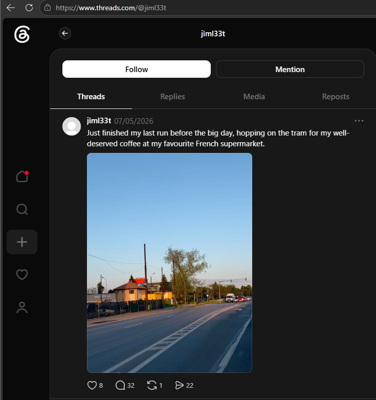
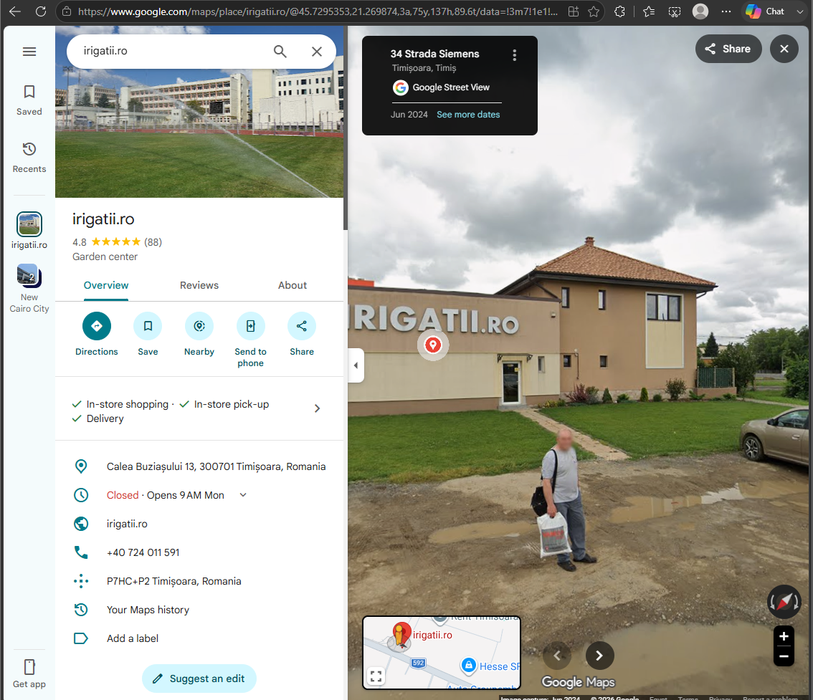

# Cache Me Outside — TryHackMe OSINT Writeup

**Room:** [Cache Me Outside](https://tryhackme.com/room/cachemeoutside)
**Category:** OSINT / Active OSINT
**Difficulty:** Easy–Medium
**Objective:** Identify a retired hacker and trace his real-world movements using only publicly available information.

---

## Overview

The room drops you into a leaked conversation screenshot between two users and asks you to reconstruct the identity of the target, `JJ^_^`, purely through OSINT — no exploitation, no brute-forcing, just following the trail of information people leave behind across platforms.

**Investigation path:**
```
Conversation screenshot → Komoot → GitHub → Commit metadata →
Active OSINT (email) → Threads → Image geolocation → Google Maps
```

---

## 1. Starting Point: The Screenshot

The provided screenshot shows a conversation between two users:



- **Target:** `JJ^_^`
- **Secondary contact:** `WKM1337?`

Embedded in the conversation is a profile link, which becomes the first pivot point of the investigation:

```
https://www.komoot.com/user/5667624959835
```

**Komoot Profile ID:** `5667624959835`

Komoot is a route-planning platform for hiking and cycling. Profiles on it commonly expose full names, activity history, and — critically — outbound links to other social profiles. That last part is what breaks the case open.
---

## 2. Pivoting from Komoot to GitHub



The Komoot profile resolves to:

- **Full Name:** `Jim Lee`
- **External Link:** `https://github.com/jiml33t`

This is the first real identity anchor: a name, tied to a platform, tied to a second platform.

### GitHub Enumeration


Visiting the linked GitHub profile:

- **Username:** `jiml33t`
- **Bio:** *"Currently starting my security consulting firm | Ex-Hacker | Avid Runner"*
- **Company:** `Jim Lee Security Consulting`
- **Public repos:** 1

The bio alone confirms the "retired hacker" premise of the room. The single repository is the next thing worth digging into.

### Commit History → Leaked Email

The repo's README is the default GitHub profile template, but the **commit history** tells a different story. Pulling the patch for the initial commit reveals author metadata GitHub doesn't scrub by default:

```
From 7b2c8e0a540c36f2e09da5945066020621d6a059 Mon Sep 17 00:00:00 2001
From: jimleepro1-cell <jimleepro1@gmail.com>
Date: Thu, 16 Apr 2026 03:27:19 -0400
Subject: [PATCH] Initial commit
```

This gives us:

- **Leaked email:** `jimleepro1@gmail.com`
- **Author/second account:** `jimleepro1-cell`
- **Timestamp offset:** `-0400` (UTC-4 / Eastern Daylight Time — consistent with the US/Canada East Coast)

**Lesson:** Git commit metadata (author name + email) is baked into the repo's history even if the visible README looks generic. Checking `git log` or a raw `.patch` file is a standard first move whenever a target has public repos.

---

## 3. Active OSINT: Triggering an Auto-Reply

With a real email address in hand, the investigation shifts from *passive* to *active* OSINT — instead of just searching for public data, you interact with the target and let them leak information back to you.

Sending an email to `jimleepro1@gmail.com` triggers an **automatic out-of-office / business auto-reply**, which discloses:



- **Phone number:** `+40 743 321 239`
- **Another username:** `0x4A4C`

The `+40` prefix is Romania's international country calling code, which places the target's business contact in Romania.

**Lesson:** Out-of-office and business auto-replies are an OSINT goldmine — they're designed to be informative, and most people don't think of them as something to lock down. Sending a single email can cost nothing and return contact details that no amount of passive searching would surface.

---

## 4. Cross-Platform Username Correlation

With three usernames now collected (`jiml33t`, `jimleepro1-cell`, `0x4A4C`), the next step is enumeration across other platforms. Running `maigret` against `jiml33t` turns up several hits:

```bash
maigret jiml33t
```

Key results:

| Platform | Finding |
|---|---|
| **Instagram** | `jiml33t` — fullname "JimLee", 22 followers, public account |
| **GitHub** | Confirms bio, company, and account creation date |
| **Threads** | `jiml33t` — fullname "JimLee", 17 followers, 3 posts |
| **GitHub Gist** | Same username, no additional content |

Instagram doesn't offer much beyond confirming the name. **Threads is where the real lead is** — one of the three posts contains a photo with visible environmental context.

**Lesson:** A reused username is one of the strongest correlators in OSINT. Once you have one distinctive handle, running it through an aggregator like Maigret, Sherlock, or WhatsMyName across dozens of platforms at once is far faster than manually checking each site.

---

## 5. Geolocating the Threads Photo



The Threads post shows the target at a supermarket, with a storefront sign reading:

```
IRIGATII.RO
```



This is a Romanian agricultural/irrigation supply company name — a distinctive enough search term to plug straight into Google Maps. That search resolves to a specific store location:

> **Calea Buziașului 13, 300701 Timișoara, Romania**

This places the target in **Timișoara**, Romania's third-largest city — consistent with the `+40` phone prefix recovered from the email auto-reply.

**Lesson:** A single storefront sign in the background of a casual photo can be enough to pin down a city block. Businesses with distinctive, locally-specific names (rather than international chains) are especially easy to geolocate.

---

## 6. Final Pivot: The Transit Stop

The room's final question asks for the name of the tram/transit station nearest the identified location — the implied "last known position" of the target on a specific date.

Cross-referencing:

- The confirmed store location (Calea Buziașului 13, Timișoara)
- Timișoara's public tram network map
- The nearest stop along that line

...points to:

> **Piața Gheorghe Domășneanu** *(Liviu Rebreanu – AEM line)*

**Lesson:** The final answer isn't handed to you directly — it requires combining a weak signal (a store's address) with an external reference (a public transit map) to derive something that wasn't explicitly stated anywhere in the target's own posts. This is the "connecting the dots" step that separates OSINT from simple searching.

---

## Summary of Findings

| Data Point | Value | Source |
|---|---|---|
| Full name | Jim Lee | Komoot |
| GitHub handle | jiml33t | Komoot link |
| Leaked email | jimleepro1@gmail.com | Git commit metadata |
| Phone number | +40 743 321 239 | Email auto-reply |
| Alt. usernames | jimleepro1-cell, 0x4A4C | Commit / auto-reply |
| Social accounts | Instagram, Threads, GitHub Gist | Username reuse (maigret) |
| City | Timișoara, Romania | Photo geolocation |
| Nearest transit stop | Piața Gheorghe Domășneanu | Map correlation |

---

## Key Takeaways

1. **Reused usernames are a goldmine.** A single distinctive handle (`jiml33t`) linked every other platform together.
2. **Metadata outlives the content it's attached to.** A generic-looking README hid a real email address in its commit history.
3. **Auto-replies are an active OSINT vector.** They're designed to share information — the target just didn't intend it to go to a stranger.
4. **Photos leak location even without EXIF/GPS data.** A storefront sign was enough to geolocate the target to a specific city block.
5. **No single source told the whole story.** Komoot, GitHub, email, and Threads each contributed one piece; the full identity only emerged by chaining them together.

*This writeup covers the "Cache Me Outside" room on TryHackMe, a fictional-persona lab built for practicing OSINT methodology. All target details belong to the room's constructed scenario.*
